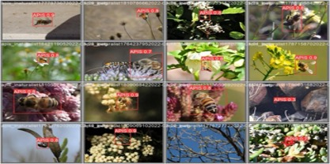

# Biodiversity Sensor - Species Identification

## Overview
Species Identification is an open-source repository that's part of Syngenta's Biodiversity Sensor Project. 
This document describes how a YOLOv5-based architecture could be used to tackle the challenge of detecting 
insect species from remotely captured images and presents the results achieved from it. Additionally, it 
includes a runnable example with detailed instructions for reproduction.

## Dataset
In the initial phase of the research, a comprehensive dataset was generated using internet images sourced 
from iNaturalist and GBIF. As the project progressed, new images obtained during field deployment were added 
iteratively to enhance the robustness of the model.

### Field Data Annotation Process
To enhance the efficiency of the data annotation process, [Roboflow](https://docs.roboflow.com/) was utilized. 
This web-based platform is designed to streamline the management, augmentation, and labeling of datasets for computer 
vision tasks. By leveraging insights from previously trained models, Roboflow significantly accelerated 
the annotation workflow of the additional images.

## Model
The attached script provides a clear overview of the steps to create a YOLOv5 model, from training to image 
detection. For detailed information, the full documentation is available on the [Ultralytics YOLOv5 webpage](https://docs.ultralytics.com/yolov5/).

## Results
<table>
  <tr>
    <th bgcolor="#FFF">Bee species</th>
    <th bgcolor="#FFF">Butterfly species</th>
    <th bgcolor="#FFF">Hoverfly species</th>
    <th bgcolor="#FFF">Other</th>
  </tr>
   <tr>
    <td bgcolor="#90EE90">Amegilla sp.</td>
    <td bgcolor="#90EE90">Aglais io</td>
    <td bgcolor="#90EE90">Episyrphus balteatus</td>
    <td bgcolor="#90EE90">Chrysoperla carnea</td>
  </tr>
  <tr>
    <td bgcolor="#90EE90">Andrena cineraria</td>
    <td bgcolor="#90EE90">Aglais urticae</td>
    <td bgcolor="#90EE90">Eristalis tenax</td>
    <td bgcolor="#90EE90">Nezara viridula</td>
  </tr>
  <tr>
    <td bgcolor="#90EE90">Andrena fulva</td>
    <td bgcolor="#90EE90">Hylaeus signatus</td>
    <td bgcolor="#FFFFFF"></td>
    <td bgcolor="#FFFFFF"></td>
  </tr>
  <tr>
    <td bgcolor="#90EE90">Andrena haemorrhoa</td>
    <td bgcolor="#90EE90">Lasiommata megera</td>
    <td bgcolor="#FFFFFF"></td>
    <td bgcolor="#FFFFFF"></td>
  </tr>
  <tr>
    <td bgcolor="#8FBC8F">Apis mellifera</td>
    <td bgcolor="#90EE90">Lycaena phlaeas</td>
    <td bgcolor="#FFFFFF"></td>
    <td bgcolor="#FFFFFF"></td>
  </tr>
  <tr>
    <td bgcolor="#8FBC8F">Bombus terrestris</td>
    <td bgcolor="#90EE90">Maniola jurtina</td>
    <td bgcolor="#FFFFFF"></td>
    <td bgcolor="#FFFFFF"></td>
  </tr>
  <tr>
    <td bgcolor="#90EE90">Halictus sp.</td>
    <td bgcolor="#90EE90">Pieris rapae</td>
    <td bgcolor="#FFFFFF"></td>
    <td bgcolor="#FFFFFF"></td>
  </tr>
  <tr>
    <td bgcolor="#90EE90">Lasioglossum sp.</td>
    <td bgcolor="#90EE90">Polyommatus icarus</td>
    <td bgcolor="#FFFFFF"></td>
    <td bgcolor="#FFFFFF"></td>
  </tr>
  <tr>
    <td bgcolor="#90EE90">Lipotriches sp.</td>
    <td bgcolor="#90EE90">Vanessa atalanta</td>
    <td bgcolor="#FFFFFF"></td>
    <td bgcolor="#FFFFFF"></td>
  </tr>
  <tr>
    <td bgcolor="#8FBC8F">Megachile sp.</td>
    <td bgcolor="#90EE90">Vanessa cardui</td>
    <td bgcolor="#FFFFFF"></td>
    <td bgcolor="#FFFFFF"></td>
  </tr>
  <tr>
    <td bgcolor="#8FBC8F">Osmia cornuta</td>
    <td bgcolor="#FFFFFF"></td>
    <td bgcolor="#FFFFFF"></td>
    <td bgcolor="#FFFFFF"></td>
  </tr>
  <tr>
    <td bgcolor="#90EE90">Xylocopa violacea</td>
    <td bgcolor="#FFFFFF"></td>
    <td bgcolor="#FFFFFF"></td>
    <td bgcolor="#FFFFFF"></td>
  </tr>
</table>

<table>
  <tr>
    <td>
      
       
      <em>Description of Image 1</em>
    </td>
    <td>
      
       
      <em>Description of Image 2</em>
    </td>
  </tr>
</table>

Here's the information from the image converted into a Markdown table:

| Bee species | Butterfly species | Hoverfly species | Other |
|----------|----------|----------|----------|
| Amegilla sp. | Aglais io | Episyrphus balteatus | Chrysoperla carnea |
| Andrena cineraria | Aglais urticae | Eristalis tenax | Nezara viridula |
| Andrena fulva | Hylaeus signatus |  |  |
| Andrena haemorrhoa | Lasiommata megera |  |  |
| Apis mellifera | Lycaena phlaeas |  |  |
| Bombus terrestris | Maniola jurtina |  |  |
| Halictus sp. | Pieris rapae |  |  |
| Lasioglossum sp. | Polyommatus icarus |  |  |
| Lipotriches sp. | Vanessa atalanta |  |  |
| Megachile sp. | Vanessa cardui |  |  |
| Osmia cornuta |  |  |  |
| Xylocopa violacea |  |  |  |
