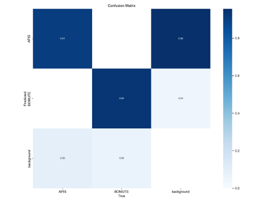
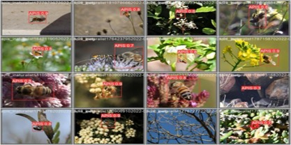
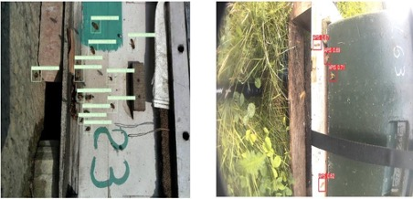
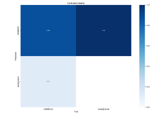
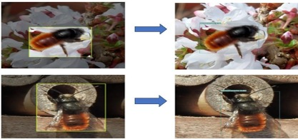
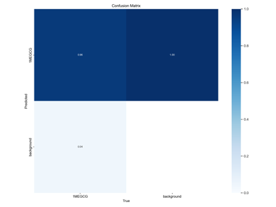
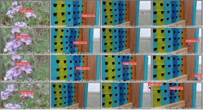

# Biodiversity Sensor - Species Identification

## Overview
Species Identification is an open-source repository that's part of Syngenta's Biodiversity Sensor Project. 
This document describes how a YOLOv5-based architecture could be used to tackle the challenge of detecting and identifying 
insect species from remotely captured images and presents the results achieved from it. Additionally, it 
includes a runnable example with detailed instructions for reproduction.

## Dataset
In the initial phase of the research, a comprehensive dataset was generated using internet images sourced 
from iNaturalist and GBIF. As the project progressed, new images obtained during field deployment were added 
iteratively to enhance the robustness of the model.

### Field Data Annotation Process
To enhance the efficiency of the data annotation process, [Roboflow](https://docs.roboflow.com/) was utilized. 
This web-based platform is designed to streamline the management, augmentation, and labeling of datasets for computer 
vision tasks. By leveraging insights from previously trained models, Roboflow significantly accelerated 
the annotation workflow of the additional images.

### Dataset species
| Bee species | Butterfly species | Hoverfly species | Other |
|----------|----------|----------|----------|
| Amegilla sp. | Aglais io | Episyrphus balteatus | Chrysoperla carnea |
| Andrena cineraria | Aglais urticae | Eristalis tenax | Nezara viridula |
| Andrena fulva | Hylaeus signatus |  |  |
| Andrena haemorrhoa | Lasiommata megera |  |  |
| Apis mellifera ** | Lycaena phlaeas |  |  |
| Bombus terrestris ** | Maniola jurtina |  |  |
| Halictus sp. | Pieris rapae |  |  |
| Lasioglossum sp. | Polyommatus icarus |  |  |
| Lipotriches sp. | Vanessa atalanta |  |  |
| Megachile sp. ** | Vanessa cardui |  |  |
| Osmia cornuta ** |  |  |  |
| Xylocopa violacea |  |  |  |

** Species with available robust dataset of on-field image examples

## Model
The attached script provides a clear overview of the steps to create a YOLOv5 model, from training to image 
detection and identification. For detailed information, the full documentation is available on the [Ultralytics YOLOv5 webpage](https://docs.ultralytics.com/yolov5/).

## Results
This section presents confusion matrices and inference samples for species models that combine both on-field and internet image datasets. We focus specifically on species with robust on-field data, as these represent our most comprehensive real-world datasets. However, it's important to note that while these models have the most on-field examples, they don't necessarily yield the best performance. This is primarily due to the challenging nature of on-field imagery, which often includes lower resolution images, varying environmental conditions, and less clearly defined subjects. In contrast, models trained solely on internet images tend to show higher true positive rates, benefiting from higher resolution images with larger, more clearly defined objects. These factors contribute to easier pattern recognition and feature extraction during model training. Despite these challenges, the results presented here offer valuable insights into model performance under real-world conditions, balancing the ideal scenarios of internet imagery with the practical realities of on-field data collection.

* Apis mellifera + Bombus terrestris

 Confusion Matrix 

 Inference from internet dataset 

 Inference from on-field dataset 

* Osmia cornuta

 Confusion Matrix 

 Specie inference 

* Megachille sp.

 Confusion Matrix 

 Specie inference 

